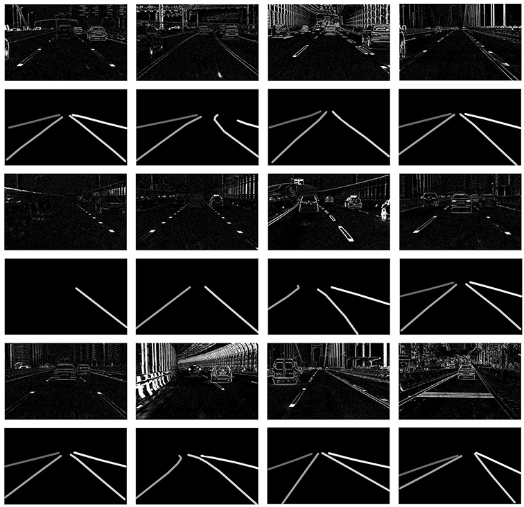

### About DET
Lane extraction is a basic yet necessary task for autonomous driving. Although past years have witnessed major advances in lane extraction with deep learning models, they all aim at ordinary RGB images generated by framebased cameras, which limits their performance in nature. To tackle this problem, we introduce Dynamic Vision Sensor (DVS), a type of event-based sensor to lane extraction
task and build a high-resolution DVS dataset for lane extraction (DET). We collect the raw event data and generate 5,424 event-based sensor images with a resolution of 1280x800, **the highest one among all DVS datasets available now.** These images include complex traffic scenes and various lane types. All images of DET are annotated with multi-class segmentation format. The fully annotated DET
images contains 17,103 lane instances, each of which is labeled pixel by pixel manually. We evaluate state-of-the-art lane extraction models on DET to build a benchmark for lane extraction task with event-based sensor images. Experimental results demonstrate that DET is quite challenging for even state-of-the-art lane extraction methods. **DET
is made publicly available, including the raw event data, accumulated images and labels.** 

### DET Components

DET consists of the raw event data, accumulated images over 30ms and corresponding lane labels. Below is the sample of DET.

#### Raw Event Data
We mount the event-camera CeleX V with high resolution 1280x800 on a car in different locations and record event streams by driving in Wuhan City at different time. We record over 5 hours of event stream with a sampling rate of MHz. 

The raw event data is provided at Mega(see the table below). Note that it has the binary file format. To deal with this data, you need to use specialized software provided by Cele Pixel company. The software and API are available [here](https://github.com/CelePixel/CeleX5-MIPI). 

Raw Event Data | File Size |Cloud Disk Link
------------ | -------------| -------------
20190217_1156 | 2.83  GB |[Mega link](https://mega.nz/#F!rZsi3I6J!AOdnsHfvqnR47Yc1YBIFtQ)
20190222_1427 | 6.41  GB |[Mega link](https://mega.nz/#F!rZsi3I6J!AOdnsHfvqnR47Yc1YBIFtQ)
20170217_1205 | 10.40 GB |[Mega link](https://mega.nz/#F!ef5ATKJQ!ovDXBeOEE0S-fc7REnZkHg)
20190222_1451 | 6.94  GB |[Mega link](https://mega.nz/#F!zPxCkIgT!cTKIO-ZkRvgz88r5oWOZJw)
20190222_1707 | 5.89  GB |[Mega link](https://mega.nz/#F!zPxCkIgT!cTKIO-ZkRvgz88r5oWOZJw)
20190222_1645 | 10.44 GB |[Mega link](https://mega.nz/#F!StJ1UaAI!6FK4BFS7_EKhBE0dJwdaZA)

#### Accumulated Images
We compress the raw event stream along the time dimension with &Delta;t = 30 ms. &Delta;t denotes the event stream time span that one single image corresponds to. Then we get over 150,000 images from raw event stream. We carefully choose 5,424 images containing various scenes to label.

For these images, we found that there are some noise pixels due to the event camera imaging characteristic. We simply use median filter to remove these pixels and get clean images. We provide both raw images and filtered images publicly. We recommend researchers to adopt raw images as they are more close to real world and
retain more details. Filtered images would lose some details anyway.
#### Lane Labels
We provide two types of lane labels, multi-class format and binary format. Multi-class format discriminates between diferent lanes, while binary format doesn't. 

For DET, we define lane extraction as a task to extract lanes and differentiate lanes from each other, which means we use multi-class format. We argue it's more close to practice because you need to determine which are the ego lanes for following applications. Accumulated images and corresponding labels are available on [GoogleDrive](https://drive.google.com/drive/folders/1tahDItA46QiCfvZxZeH0YCTgSR8IU2up?usp=sharing). We also provide codes to filter images, tranfer multi-class labels into binary labels, and visualize labels at the [Kit](https://github.com/Spritea/DET/tree/master/Kit).

### Links
- The raw event data is provided at Mega(see the table above). Use Chrome browser to open these links to avoid installing Mega desktop software.
- The accumulated images and corresponding labels: [GoogleDrive](https://drive.google.com/drive/folders/1tahDItA46QiCfvZxZeH0YCTgSR8IU2up?usp=sharing).
- The software and API provided by Cele Pixel company to deal with raw event data: [SDK](https://github.com/CelePixel/CeleX5-MIPI).
- The DVS device we used to construct DET: [CeleX-V](http://www.celepixel.com/#/Technology).
- Development Code: [Kit](https://github.com/Spritea/DET/tree/master/Kit).

### Contact

If you have any problem/suggestion about DET, please contact cwsinwhu@whu.edu.cn.
